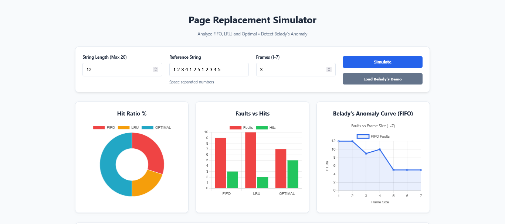
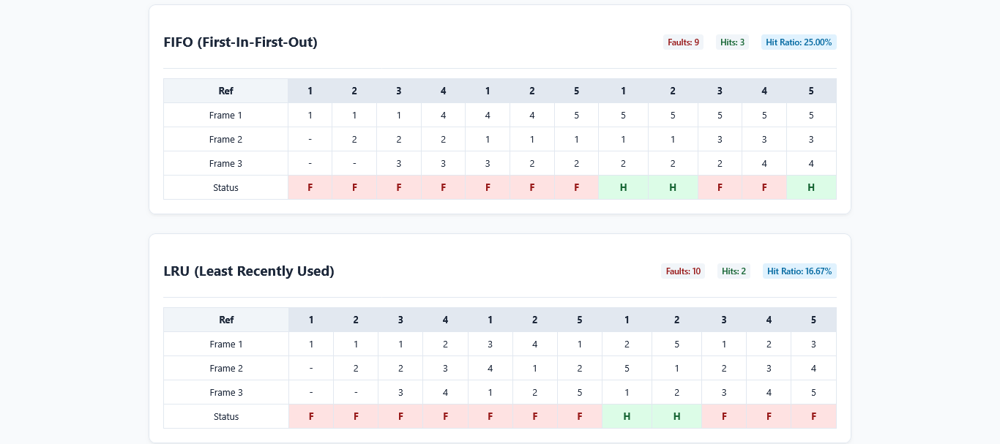

# 🔮 Belady's Anomaly & Page Replacement Simulator


> **Ever wondered why adding MORE RAM to your computer could actually make it SLOWER?** 🤯

Welcome to the **Page Replacement Simulator**. This interactive web tool visualizes how Operating Systems manage memory using **FIFO**, **LRU**, and **Optimal** algorithms. Most importantly, it visually proves **Belady's Anomaly**—a counter-intuitive phenomenon where increasing memory frames leads to *more* page faults.

### 🔗 Live Demo:: **https://os-page-replacement-simulator.vercel.app**
---


## ⚡ Features

### 🧠 The Algorithms
* **FIFO (First-In-First-Out):** The classic queue approach. (Spoiler: It's the one that breaks!)
* **LRU (Least Recently Used):** The smart "stack" approach that tracks usage history.
* **OPTIMAL:** The theoretical limit (clairvoyant) algorithm that sees the future.

### 📊 Visual Analytics (Powered by Chart.js)
* **🍩 Hit Ratio Doughnut:** A quick percentage breakdown of efficiency.
* **📊 Performance Bar Chart:** Side-by-side comparison of Faults vs. Hits.
* **📈 The Anomaly Detector:** A dedicated Line Chart that runs FIFO across **1 to 7 frames** instantly to catch the anomaly curve.

### 🎛️ User Controls
* **Custom Inputs:** Set your own Reference String and Frame Count.
* **Validation:** Smart input checking prevents crashes.
* **One-Click Demo:** Instantly load the famous "Belady's String" (`1 2 3 4 1 2 5 1 2 3 4 5`) to see the magic happen.

---

## 📸 Sneak Peek

| **Interactive Controls** | **Real-time Data Visualization** |
|:---:|:---:|
|  |  |
| *Easy configuration & Validation* | *Visualizing the Math* |

---

## 🚀 How to Run

This project is built with **Vanilla JS**—no heavy frameworks, no `npm install`, no build steps. Just pure web technology.

### 1. Project Structure
Ensure your folder looks like this:
```text
📂 page-replacement-sim/
 ├── index.html       # Index Page
 ├── simulator.html   # The structure
 ├── styles.css       # The styling
 └── simulator.js     # The logic
